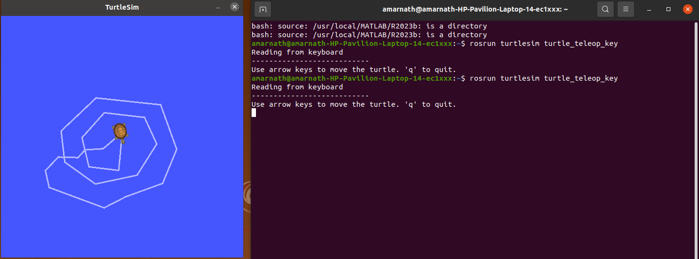
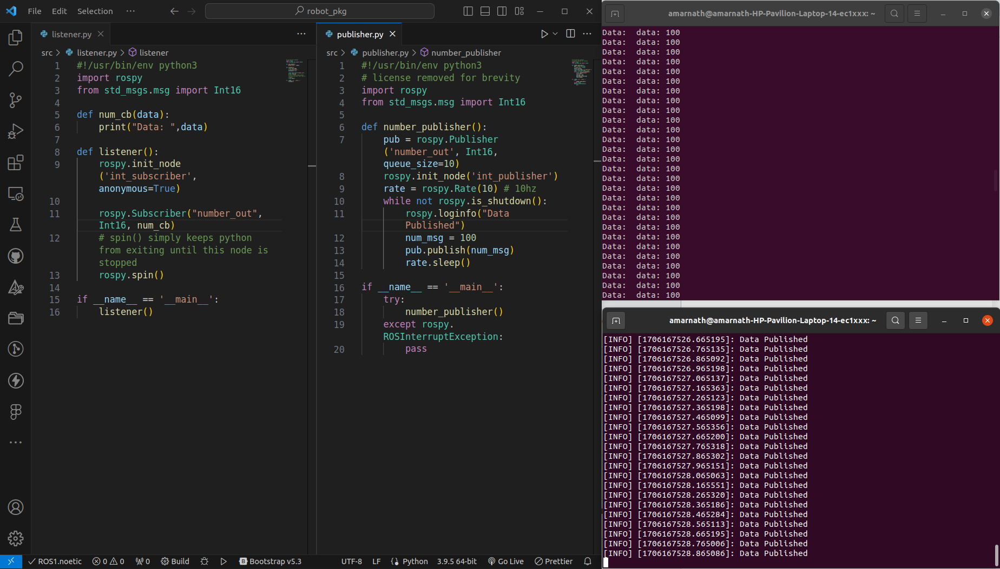

## Task 1 Submission

You can find the ROS package [here](tutorials)

- Creating a catkin workspace

```
    mkdir -p catkin_workspace/src
    cd catkin_workspace
    catkin_make

    source devel/setup.bash
```

- Creating a ROS package

```
    cd catkin_workspace/src
    catkin_create_pkg beginner_tutorials std_msgs rospy roscpp

    cd catkin_workspace
    catkin_make

    source devel/setup.bash
```

- Running turtlesim

```
    roscore
    rosrun turtlesim turtlesim_node
    rosrun turtlesim turtle_teleop_key
```

**Turtle-bot with teleop key**



**Talker-Listener example**


