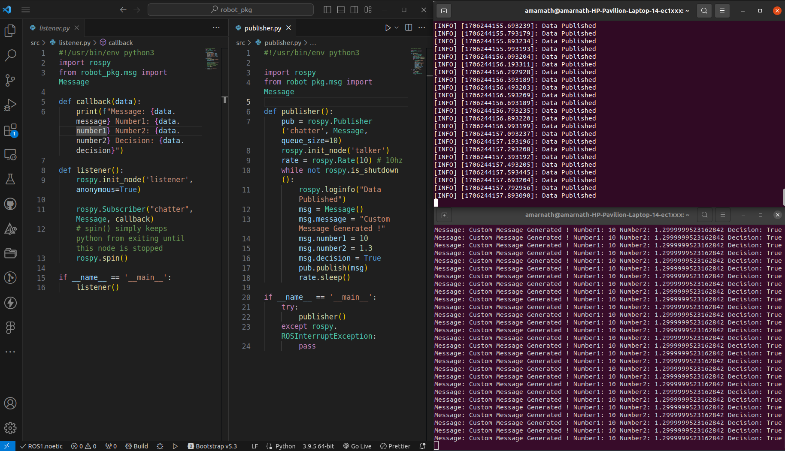
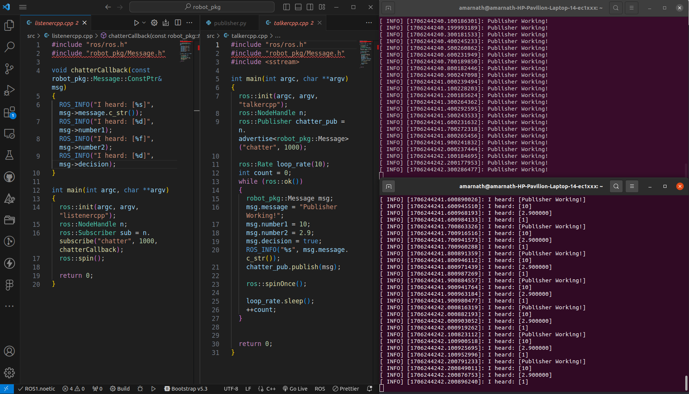
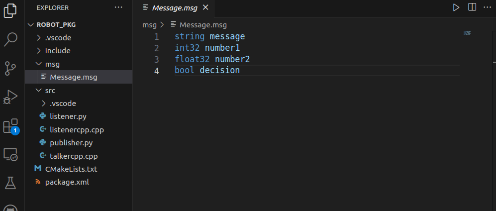

## Task 2 Submission

You can find the ROS package [here](tutorials)

- Create a msg directory in ROS package.
- Create a Message.msg file with required message headers.
- Include the Message.msg file in talker and listener.

**Pub-Sub with Custom Message in Python**

**Pub-Sub with Custom Message in C++**

**Custom Message.msg File**

