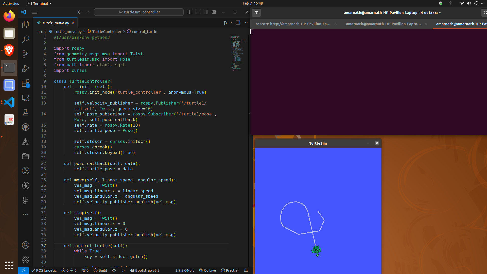
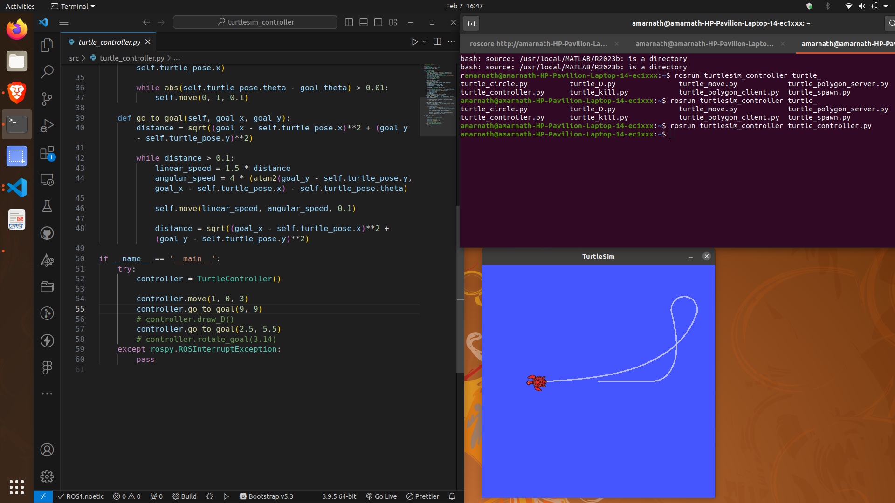
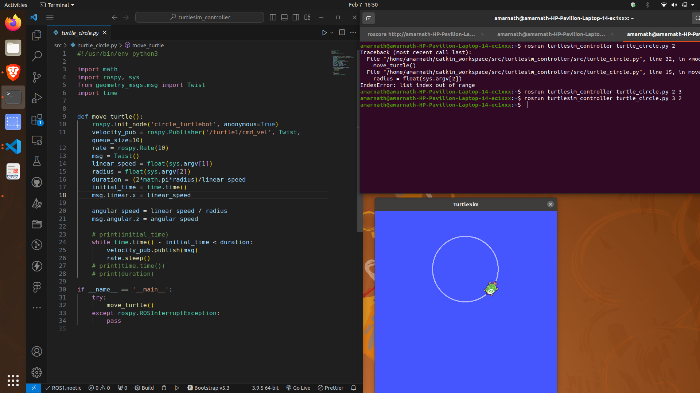
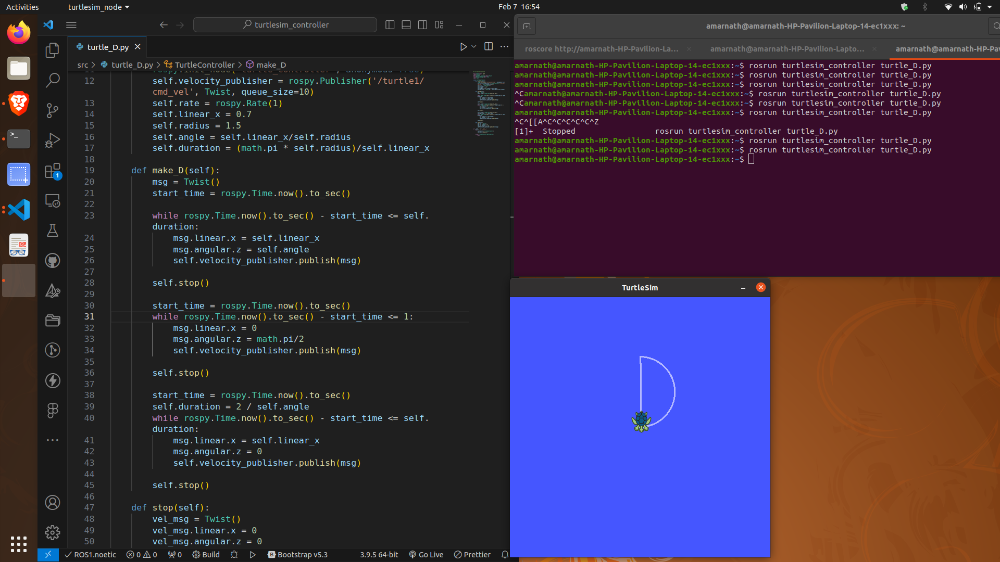
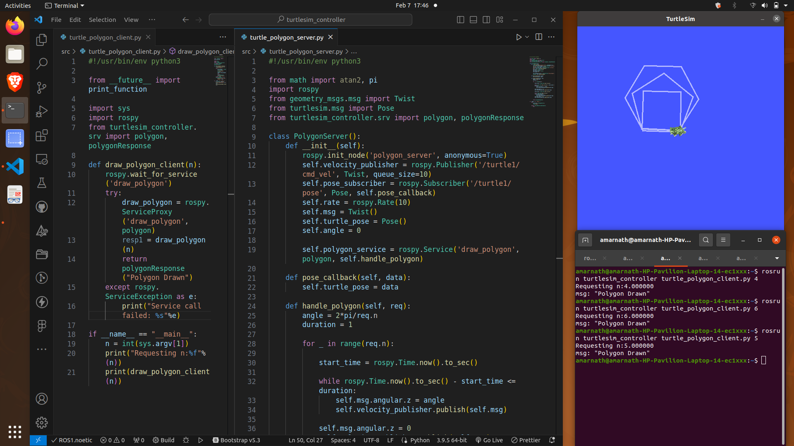
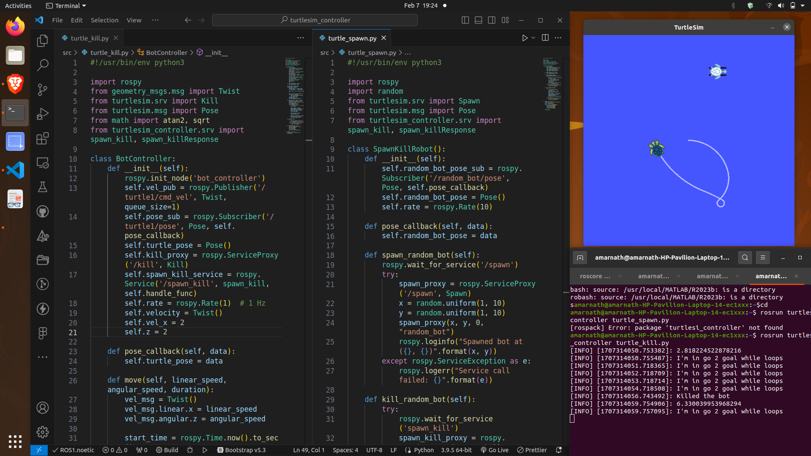
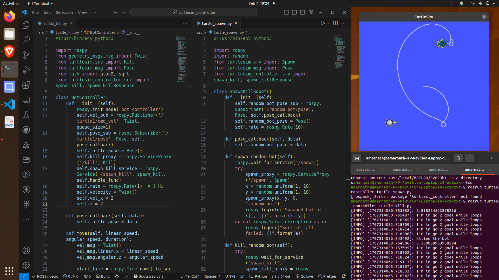

## Task 3 Submission

You can find the ROS package [here](tutorials)

- Create a srv directory in ROS package.
- Create a polygon.srv file with required request and response type and variables.
- Include the polygon.srv file in client and server, and update the package.xml & CMakeList.

**Turtle Controller**

**Turtle Draw Circle**

**Turtle Draw D**

**Turtle Draw Polygon with Client-Server Model**

**Additional Task**

