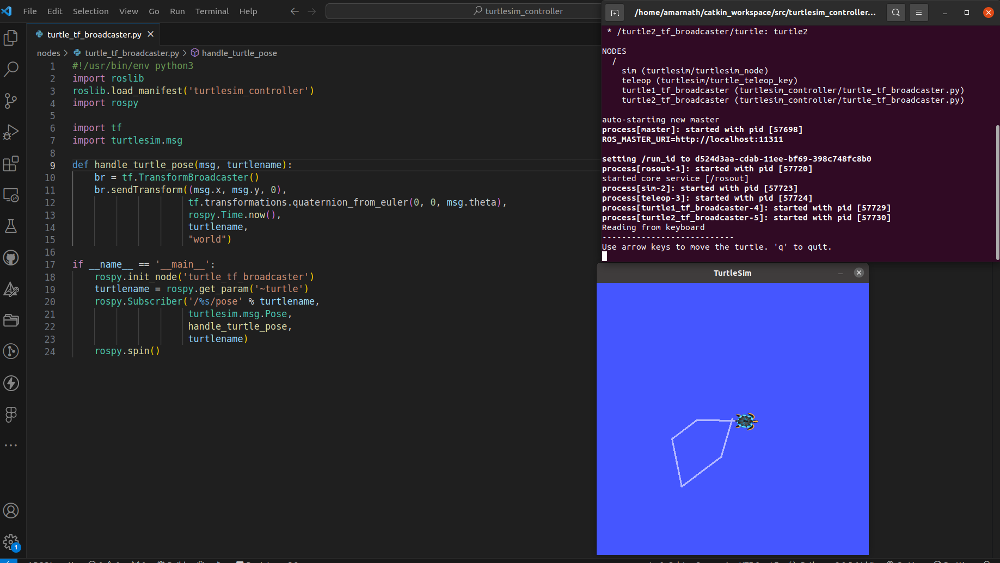
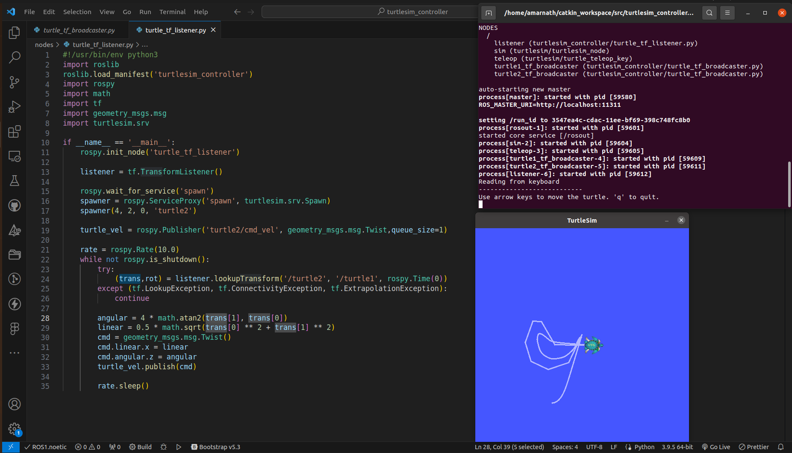
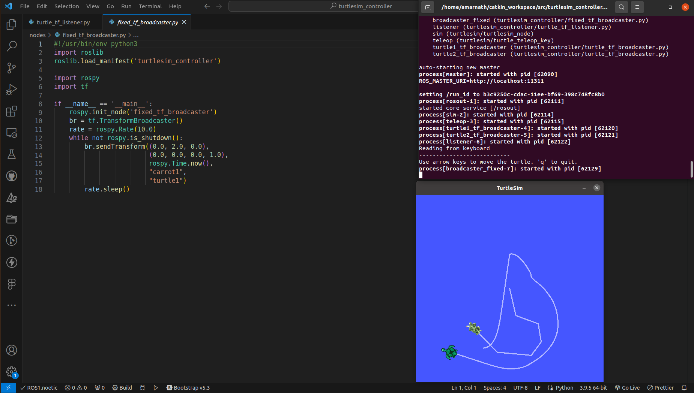
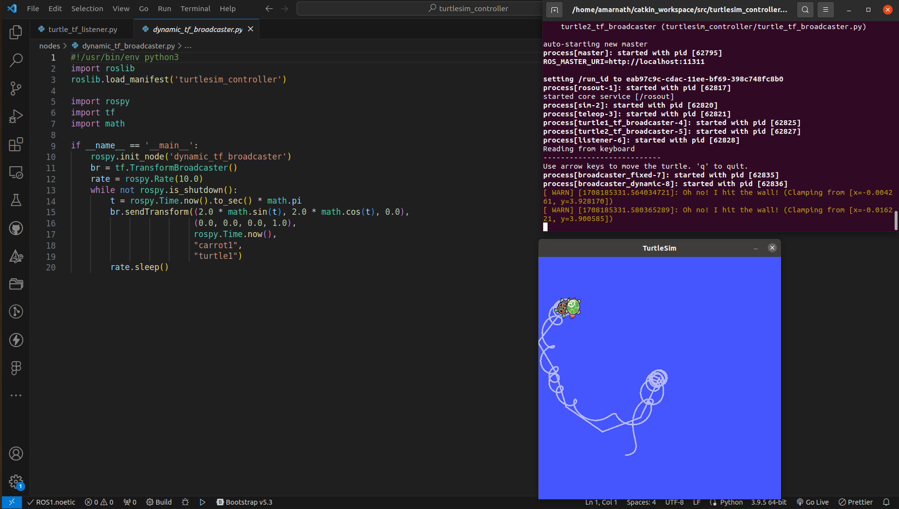
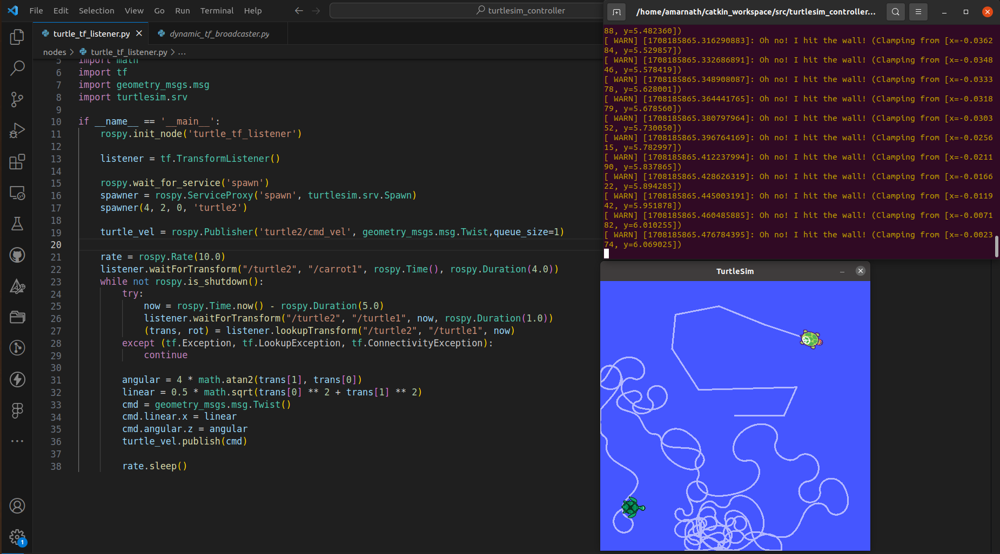
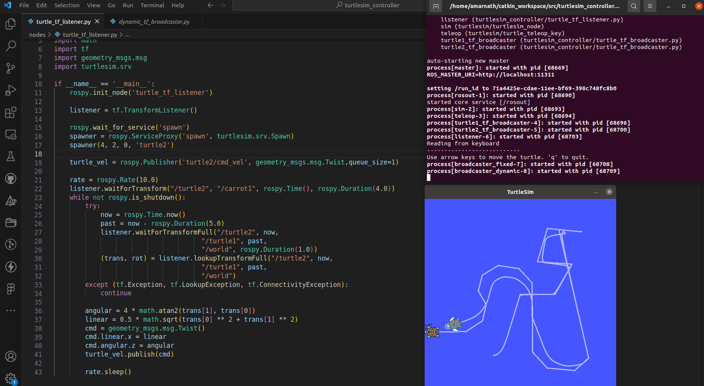
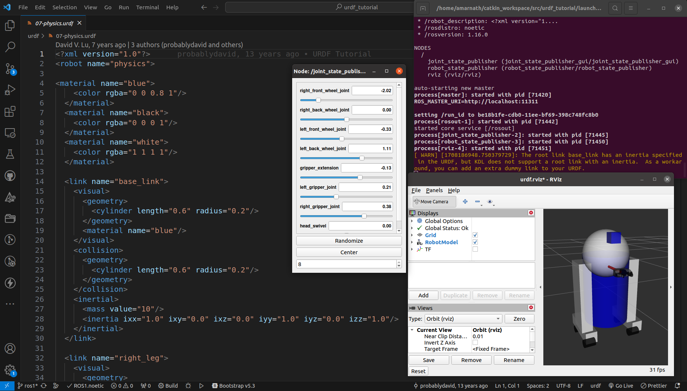
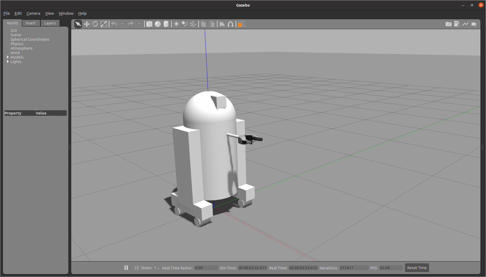

## Task 4 Submission

You can find the ROS package [here](tutorials)

**TF Tutorials**

- Create a nodes and launch directory in ROS package.
- Create the broadcaster and listener files, add them in nodes.
- Create launch file, add it in launch.
- Run using:

```
    roslaunch <ros-pkg> <launch-file>.launch
```

**Creating a Broadcaster**


**Creating a Listener**


**Adding Frames (Fixed)**


**Adding Frames (Dynamic)**


**Time Travel using TF**




**URDF Tutorials**

- Create a urdf and launch directory in ROS package.
- Create the urdf file and add to urdf.
- Create launch files for rviz and gazebo and add to launch.
- Run using:

```
    roslaunch <ros-pkg> <launch-file>.launch model:='$(find <ros-pkg>)/urdf/<urdf-file>.urdf'
```

**URDF Visualization in Rviz**


```
    roslaunch <ros-pkg> <gazebo-launch-file>.launch
```

**URDF Visualization in Gazebo**

